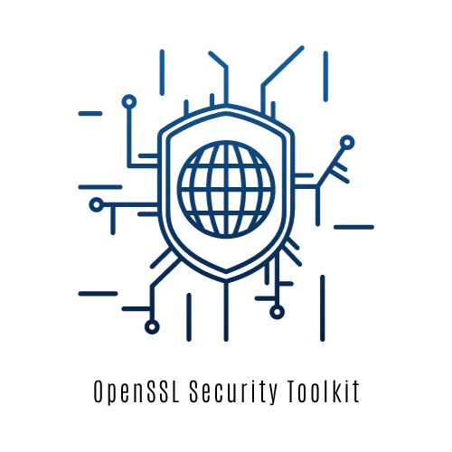

# OpenSSL Security Toolkit

## Overview

The OpenSSL Security Toolkit is a Python-based application that provides a set of cryptographic tools for secure file operations. It combines the Advanced Encryption Standard (AES) algorithm for file encryption and the RSA algorithm for key generation, signing, and validation. The toolkit includes a graphical user interface (GUI) for easy interaction.

## Features

- **AES Encryption and Decryption:**
  - Encrypt and decrypt files using the AES algorithm.
  - Utilize a user-friendly GUI for a seamless experience.

- **RSA Key Pair Generation and File Signing:**
  - Generate RSA key pairs for secure communication.
  - Sign files using the generated private key for authenticity.
  - 
- **Encryption and Signing:**
  - Combine AES encryption and RSA file signing for enhanced security.

- **File Validation and Decryption:**
  - Validate the authenticity of signed files using the corresponding public key.
  - Decrypt and validate files for secure and trusted access.

## How to Use

1. **Installation:**
   - Clone the repository to your local machine.

2. **Dependencies:**
   - Ensure you have the necessary dependencies installed. Run `pip install -r` to install them.

3. **Run the Application:**
   - Execute the `GUI.py` script to launch the graphical user interface.

4. **Use the Features:**
   - Use the GUI to perform AES encryption and decryption, generate RSA key pairs, sign and validate files, and more.

## Script Details

- **AES.py:**
  - Contains functions for AES encryption and decryption of strings and files.

- **codeTX.py:**
  - Provides functions for generating RSA key pairs and signing files.

- **codeRX.py:**
  - Includes a function for validating the signature of a file using an RSA public key.
    
- **encrypt_and_sign.py:**
  - Combines file signing and AES encryption.
    
- **decrypt_and_validate.py:**
  - Combines AES decryption and RSA signature validation.
